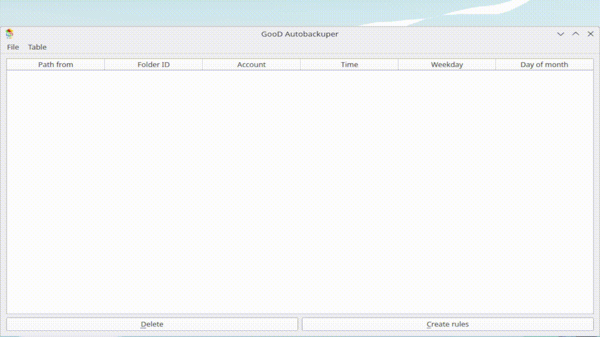
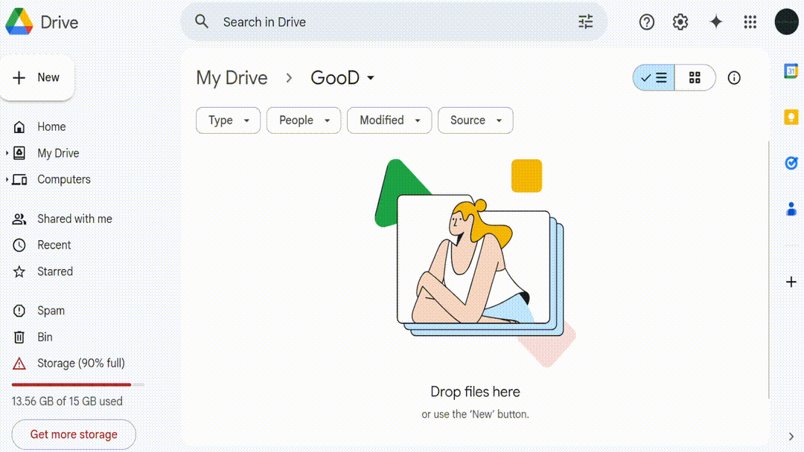

<picture>
    <source media="(prefers-color-scheme: dark)" srcset="./GooD_Autobackuper.svg">
    <source media="(prefers-color-scheme: light)" srcset="./GooD_Autobackuper.svg">
    
</picture>

# GooD Autobackuper

## About program

GooD Autobackuper — Automated Backup System for Google Drive.

Version 2.0.0.

## Author 

Github: [durysvit](https://github.com/durysvit).

Email: argnullo@gmail.com.

## User manual

**IMPORTANT**: Once or twice a month you will have to re-authorize, as Google revokes it.

## Demo





### Before starting the program

Create Google Cloud project:
1. Create a project on [Google Cloud](https://console.cloud.google.com/projectcreate) — enter project name and ID.
1. Enable the Google Cloud API­— see [Drive Python API](https://developers.google.com/drive/api/quickstart/python).
1. Configure the OAuth consent screen and add yourself as a test user: in [OAuth consent screen](https://console.cloud.google.com/apis/credentials/consent?) enable User Type — External; press "Create".
1. Add scopes: "auth/drive" and "auth/docs".
1. You also need to authorize credentials for the desktop application using an OAuth 2.0 client ID. The client ID is used to identify a single application to Google OAuth servers. Press:
    1. "API and servises";
    1. "Credentials";
    1. "Create credentials";
    1. "OAuth client ID";
    1. "Application app";
    1. "Desktop app" and enter the name of your OAuth 2.0 client.
1. Create "credentials.json" — copy the file to the root of the program project.

### After starting the program

After starting the program, you must log in to Google. 

After authorization, give access rights to your account to the GooD Autobackuper program.

### Add the program to autoload

To add a program to startup:
* for Windows users:
    - create a shortcut to the file GooD_Autobackuper.exe;
    - press the key combination "Win + R" and enter `shell:startup`;
    - move the shortcut to this folder. 
* for Linux users — run the autostartLinux.sh script.

### Remove from startup

* for Windows users:
    - press the key combination "Win + R" and enter "shell:startup";
    - remove the shortcut from this folder. 
* for Linux users — remove GooD_Autobackuper.desktop file from `~/.config/autostart`.

### Usage  

For the program to work, you need to create a rule. 

The rule consists of:
* the full path to your directory on your computer that needs to be copied;
* the Google Drive folder ID, which is located at the end of the folder link after https://drive.google.com/drive/folders/;
* the account name; 
* the time when you need to make a copy;
* and optional: the weekday or the number of the month.

In the main window, click the "Create rules" button. You will see a window to add a rule. 

Add data to the appropriate fields: 
* select folder; 
* select Google folder;
* enter your account name;
* add time to the list; if the time is entered incorrectly, select it and click "Delete";
* and optional: select the weekday or the day of the month.

If you need to delete this rule from the table, then select it in the table and click the "Delete" button.

When closing the program, it will be minimized to the tray. If you need to end the program, you need to right-click on the program icon in the tray and click "Exit".

### Problem solving

Exceptions:
* ...LineEditIsEmptyException — Path from, Folder ID, Account — raises if one of the fields in the rule creation window is empty — fill in all fields;
* TokenFileDoesNotExistException — raises if the token file does not exist — log in to Google;
* CredentialsFileDoesNotExistException — raises if credentials file doesn't exist  — register as a developer in Google Console — see subsection "Before starting the program";
* FileNotUploadedException — raises if in the file has not been uploaded to Google Drive — try again later; check your internet connection; re-authorize by deleting the "token.json" file;
* EmptyTimeListException — raises if in the Creation rule window, the time list is empty — complete the list with time;
* NoRowSelectedInTable — raises if no row was selected to delete from table — select the row;
* TokenFileIsExpiredOrRevokedException — raises if token file is expired or revoked — try delete token file and authorise again;
* etc.

**If the app does not start, try deleting the token.json file from the program directory and restart the app (from tray).**

### Recommendations

Do not abuse the number of rules, do not abuse the size of the copied files — **your account may be blocked** for suspicious actions, for automation, for spam.

It is better to set the time in the rules with a difference of at least 2 minutes.

## System requirements

System Requirements:
* OS:
    - Manjaro Linux 6.11;
    - Windows 11.

## Build the project

Download project:
* Install Git:
    * for Linux (Manjaro): `sudo pacman -S git`;
    * for Windows: install [Git](https://git-scm.com/).
* or press 'Code' and 'Download ZIP'.

Then clone the repository:

```
git clone https://github.com/username/repository-name.git
cd <replaceDirectoryName>
```

Install the latest version of [Python and Pip](https://www.python.org/).

Create a [virtual environment](https://docs.python.org/uk/3.10/library/venv.html):

```
python -m venv venv
```

Activate the virtual env. for Linux (Manjaro) run:

```
. ./venv/bin/activate
```

and for Windows run:

```
.\venv\Scripts\activate.bat
```

Run:

```
pip install -r requirements.txt
```

Assemble the project:

```
pyinstaller --onefile --windowed --icon=GooD_Autobackuper.svg --name GooD_Autobackuper main.py
```

## License

The code is distributed under the GNU GPLv3. See [LICENSE](./LICENSE).

# See also

See also:
* [Specification](./docs/specification.md);
* [Privacy policy](./PRIVACY_POLICY.md);
* [Terms of service](./TERMS_OF_SERVICE.md).

