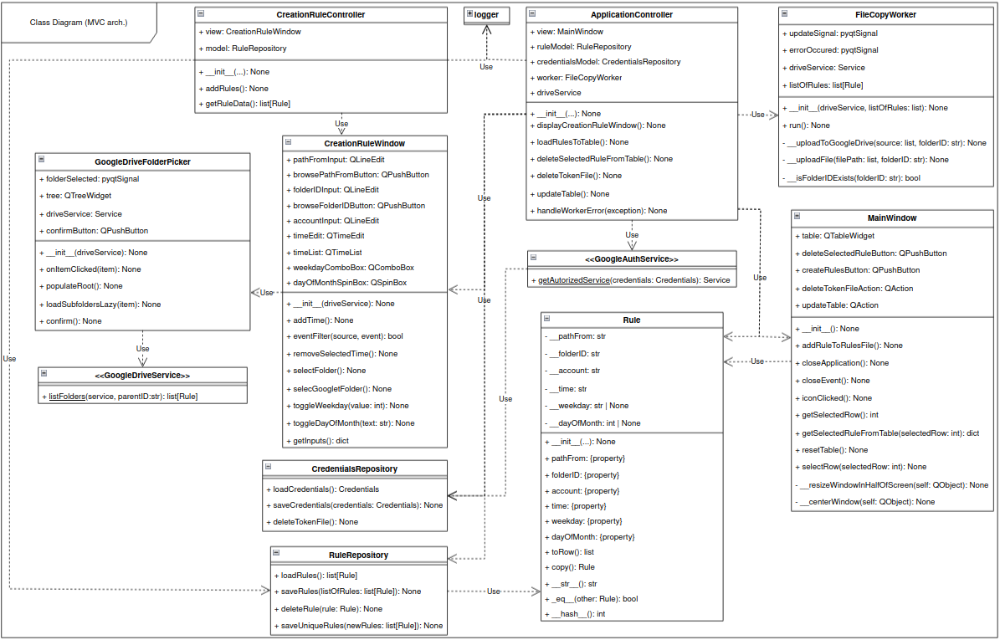
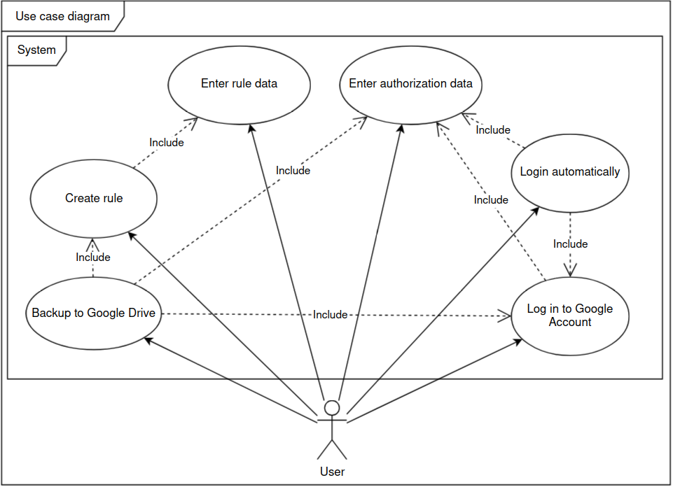
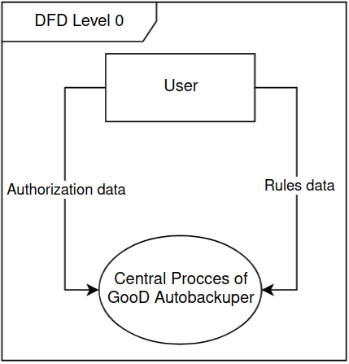
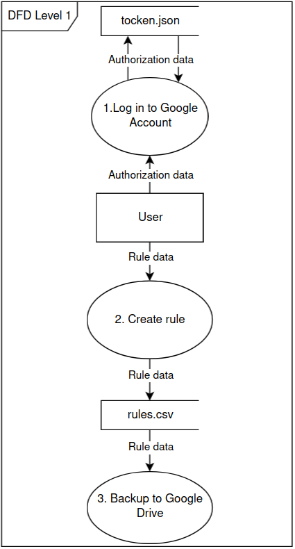
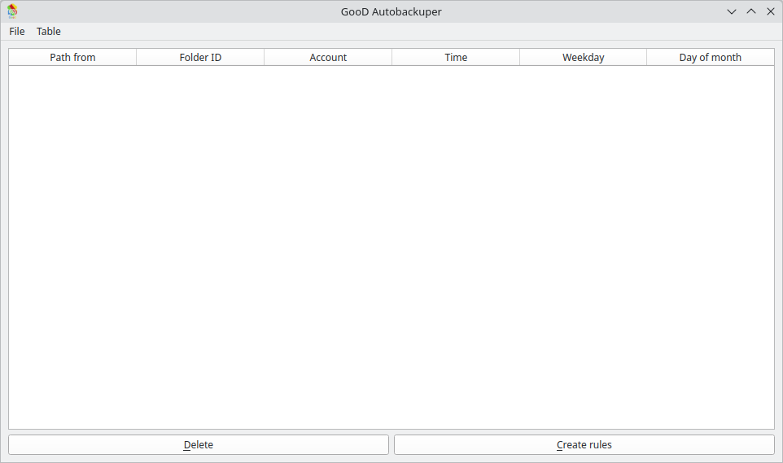
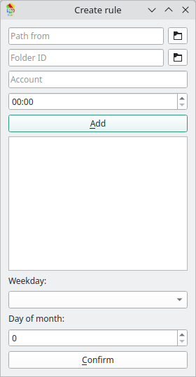
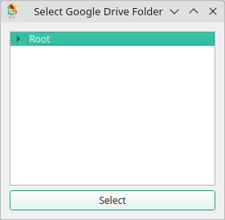

# Terms of reference "Automated Backup System for Google Drive"

<picture>
    <source media="(prefers-color-scheme: dark)" srcset="../GooD_Autobackuper.svg">
    <source media="(prefers-color-scheme: light)" srcset="../GooD_Autobackuper.svg">
    
</picture>

# Content

* [Versions](#versions)
* [About](#about)
    - [Out of scopes](#out-of-scopes)
* [Project requirements](#project-requirements)
    - [Functional requirements](#functional-requirements)
    - [Non-functional requirements](#non-functional-requirements)
    - [Architecture](#architecture)
* [Diagrams](#diagrams)
    - [Class Diagram](#class-diagram)
    - [Use Case Diagram](#use-case-diagram)
    - [DFD0](#dfd0)
    - [DFD1](#dfd1)
* [Modules](#modules)
    - [Main window](#main-window)
    - [Creation rule window](#creation-rule-window)
    - [Google Drive folder picker](#google-drive-folder-picker)
* [Localization](#localization)

# Versions

| Version | Author   | Date       | Description                      |
|---------|----------|------------|----------------------------------|
| 0.0.1   | durysvit | 17.06.2024 | Project initialization           |
| 2.0.0   | durysvit | 05.06.2025 | Software update to version 2.0.0 |

# About

This project is dedicated to the design and development of an automated backup system for Google Drive.

## Out of scopes

The program does not take into account that your Google Drive has little or no memory; it also does not take into account an unstable or poor connection.

# Project requirements 

## Functional requirements

Functional requirements include the following capabilities:
* The user can launch the application with a graphical user interface (GUI);
* The user must authorize their Google account to use the application;
* The application should support automatic re-authorization;
* The user must register a project in the Google Cloud Console;
* The application requires two files to operate: `token.json` for user authorization and `credentials.json` for developer access; 
* The main window of the application must include:
    - A table displaying user-defined backup rules;
    - A "Create rules" button to open the rule creation window;
    - A "Delete" button to remove the selected rule;
    - A "File" menu with an option to delete the token file;
* The user can define backup rules using a dedicated modal window (Rule Creation Window), which includes:
    - A read-only field displaying the full path to the source directory;
    - A button with a folder icon to open a local folder picker;
    - A read-only field displaying the selected Google Drive folder ID;
    - A button with a folder icon to open the Google Drive folder picker;
    - A field for the Google account label;
    - A time picker widget;
    - A list of unique backup times;
    - A button to add a time to the list;
    - A dropdown for selecting a weekday;
    - A spinbox for selecting a day of the month;
    - A "Confirm" button to save the rule;
* The Google Drive folder picker must display a hierarchical directory tree with a "Select" button;
* To create a rule, the user must specify:
    - The source folder path;
    - The destination Google Drive folder ID;
    - The backup time (HH:MM);
    - Optionally, the day of the week or the day of the month;
* The application must show appropriate error messages for invalid inputs or conditions:
    - Missing source path;
    - Missing Google Drive folder ID;
    - Missing account label;
    - Empty list of backup times;
    - Invalid or blank weekday;
    - Invalid day of month;
    - Empty rule list;
    - Missing or unreadable rule file;
    - Missing or invalid `credentials.json` or `token.json`;
    - No rule selected when attempting to delete;
    - Google Drive upload failures;
    - Nonexistent Google Drive folder ID;
    - Other similar critical errors;
* Existing rules can be deleted;
* Backed-up files must overwrite previous versions in Google Drive;
* When the main window is closed, the application should minimize to the system tray and continue running;
* Clicking "Exit" in the tray menu must terminate the application;
* The application must display an icon in the tray.

## Non-functional requirements

Non-functional requirements include:
* The application stores authentication tokens and credentials in `token.json` and `credentials.json`, respectively;
* It must support background operation after launch;
* Authorization data must persist to support automatic login;
* Only one Google account can be authorized at a time;
* Time values must follow the "HH:MM" format;
* Backup rules must be saved in a CSV file containing:
    - Source directory;
    - Destination folder ID;
    - Time;
    - Optionally, day of week or day of month;
* The Google Drive folder ID is obtained from the Drive folder URL or set as `"root"` for the top-level directory;
* The source directory must be an absolute file system path;
* The application is guaranteed to run on Windows 11 and Manjaro Linux 6.11;
* The application icon must be in SVG format.

## Architecture

The application follows the MVC (Model-View-Controller) design pattern, where:
- Views include all GUI components and user-facing dialogs;
- Models handle data operations (rules, authorization, file paths);
- Controllers coordinate logic between views and models;
- Workers handle long-running or background tasks (e.g., file uploads);
- Services communicate with Google Drive APIs.

# Diagrams

The following diagrams must be created:
* Class Diagram — includes all classes with their relationships, access modifiers, and associations.
* Use Case Diagram — describes the main functional interactions between the user and the system;
* DFD Level 0 and Level 1 — describe data flows in the system.

## Class Diagram

The class diagram describes the MVC architecture and the interaction between:
* Windows (views);
* Models that handle data;
* Workers;
* Services;
* Controllers that coordinate all components.

## Use Case Diagram

The use case diagram shows the user's capabilities:
* Enter authorization data;
* Enter backup rule data;
* Log in to a Google account;
* Log in automatically;
* Perform file backups.

## DFD0

Describes two main data flows from the user to the system:
* Authorization data;
* Rule data.

## DFD1

Describes:
- Authorization data flows from the user through the authorization process (1) into the `token.json` storage;
- Rule data flows through the rule creation process (2) into the `rules.csv` file and then into the data backup process (3).

# Modules

## Main window

The main window includes:
* A table for displaying and selecting backup rules;
* Buttons:
    - To delete a selected rule;
    - To create a new rule;
* A menu with options:
    - Delete the token file;
    - Refresh the table.

## Creation rule window

The rule creation window includes:
* Fields for selecting the local source directory and entering the account name;
* A read-only field and button for selecting a Google Drive folder;
* A time selection widget;
* A weekday selection dropdown;
* A day-of-month selection spinner.

The Google Drive folder picker is described in the next subsection.

## Google Drive folder picker

The folder picker includes:
* A hierarchical tree of folders from the user's Google Drive;
* A button to confirm the selected folder.

# Localization

The default language is English.

Other languages are not required.
